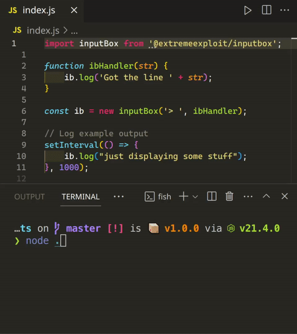

# inputbox

A library that allows you to use both stdin and stdout without worrying about them overlapping

# Example
```js
import inputBox from '@extremeexploit/inputbox';

function ibHandler(str) {
    ib.log('Got the line ' + str);
}

const ib = new inputBox('> ', ibHandler);

// Log example output
setInterval(() => {
    ib.log("just displaying some stuff");
}, 1000);
```

